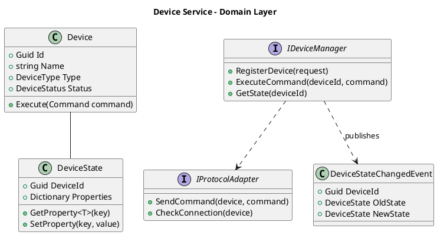
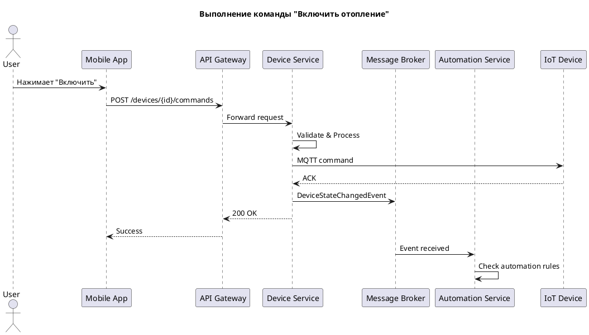
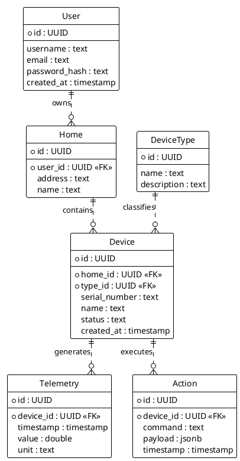

# Project_template

Это шаблон для решения проектной работы. Структура этого файла повторяет структуру заданий. Заполняйте его по мере работы над решением.

# Задание 1. Анализ и планирование

### 1. Описание функциональности монолитного приложения

**Управление отоплением:**

- Пользователи могут удалённо включать и выключать отопление в своих домах через веб-интерфейс
- Система отправляет команды управления на датчики/реле отопления синхронно
- Каждая установка требует выезда специалиста для подключения системы отопления к платформе
- Пользователь не может самостоятельно подключить датчик к системе

**Мониторинг температуры:**

- Пользователи могут просматривать текущую температуру в своих домах через веб-интерфейс
- Система получает данные о температуре с датчиков по запросу (pull-модель)
- Данные запрашиваются синхронно от сервера к датчику
- Поддерживается CRUD операции для управления сенсорами (создание, чтение, обновление, удаление)
- Сенсоры имеют атрибуты: название, тип, локация, значение, единица измерения, статус

### 2. Анализ архитектуры монолитного приложения

| Характеристика | Описание |
|----------------|----------|
| **Язык программирования** | C# (.NET 10) |
| **База данных** | PostgreSQL 16 |
| **ORM** | Entity Framework Core 10 |
| **Архитектура** | Монолитная — все компоненты (Controllers, Services, Data Access) в одном приложении |
| **API** | REST API (ASP.NET Core Web API) |
| **Взаимодействие** | Синхронное — запросы обрабатываются последовательно, блокирующие HTTP-вызовы к внешним сервисам |
| **Внешние интеграции** | Temperature API — внешний сервис для получения данных температуры |
| **Контейнеризация** | Docker, Docker Compose |

**Структура кода:**

```
SmartHome.Api/
├── Controllers/     # HTTP endpoints (SensorsController, HealthController)
├── Models/          # Entity models и DTOs (Sensor, SensorCreateDto, etc.)
├── Data/            # DbContext для работы с PostgreSQL
├── Services/        # Бизнес-логика (TemperatureService)
└── Program.cs       # Точка входа и конфигурация DI
```

### 3. Определение доменов и границы контекстов

#### 3.1. Основной домен (Domain)

**Домен: Управление умным домом (Smart Home Management)**

Это основная область деятельности компании "Тёплый дом". Домен охватывает все аспекты удалённого управления домашними устройствами и автоматизации.

#### 3.2. Классификация поддоменов (Subdomains)

| Тип | Поддомен | Описание | Обоснование классификации |
|-----|----------|----------|---------------------------|
| **Core** | **Управление устройствами (Device Management)** | Регистрация, настройка, подключение устройств разных производителей по стандартным протоколам | Ключевое конкурентное преимущество — экосистема должна поддерживать устройства партнёров. Это то, за что платят клиенты |
| **Core** | **Автоматизация (Automation)** | Сценарии работы устройств, правила, триггеры, расписания | Уникальная ценность для пользователя — возможность программировать умный дом под свои нужды |
| **Supporting** | **Телеметрия (Telemetry)** | Сбор, хранение и предоставление данных с датчиков | Необходима для работы системы, но сама по себе не даёт конкурентного преимущества. Можно оптимизировать под свои нужды |
| **Supporting** | **Отопление (Heating)** | Управление температурой, котлами, термостатами | Текущий функционал компании, важен для бизнеса, но логика управления типовая |
| **Supporting** | **Освещение (Lighting)** | Управление светом, диммерами, RGB-лентами | Новый модуль для расширения, стандартная логика вкл/выкл/яркость |
| **Supporting** | **Видеонаблюдение (Surveillance)** | Просмотр видео с камер, запись, детекция движения | Новый модуль, можно интегрировать существующие решения |
| **Supporting** | **Управление воротами (Gate Control)** | Открытие/закрытие ворот, шлагбаумов | Простая логика, но важна для целевой аудитории (посёлки) |
| **Generic** | **Идентификация (Identity)** | Регистрация, аутентификация, авторизация, управление пользователями | Стандартная задача, можно использовать готовые решения (Keycloak, Auth0, IdentityServer) |
| **Generic** | **Биллинг (Billing)** | Подписки, оплата модулей, SaaS-модель | Типовая задача, есть готовые решения (Stripe, ЮKassa). Не требует уникальной разработки |
| **Generic** | **Уведомления (Notifications)** | Push, Email, SMS оповещения | Стандартный функционал, много готовых сервисов |

#### 3.3. Почему именно такое разделение?

**Core-поддомены (ядро бизнеса):**
- **Device Management** — это ядро, потому что по условию задачи компания "не занимается производством устройств, но поддерживает подключение устройств партнёров по стандартным протоколам". Именно способность интегрировать разные устройства — конкурентное преимущество.
- **Automation** — покупатели "могут программировать систему для управления различными модулями". Это ключевая фича, отличающая платформу от простого пульта управления.

**Supporting-поддомены (поддерживающие):**
- Конкретные типы устройств (Heating, Lighting, Gate, Surveillance) — это модули, которые продаются отдельно. Они важны для бизнеса, но их логика достаточно типовая.
- **Telemetry** — без неё система не работает, но это инфраструктурный компонент.

**Generic-поддомены (общие):**
- **Identity, Billing, Notifications** — решают стандартные задачи, не связанные напрямую с умным домом. Для них есть готовые решения на рынке.

#### 3.4. Bounded Contexts (Ограниченные контексты)

Каждый поддомен имеет свой ограниченный контекст с чёткими границами:

| Bounded Context | Ubiquitous Language (единый язык) | Ключевые сущности |
|-----------------|-----------------------------------|-------------------|
| **Device Context** | Device, Sensor, Actuator, Protocol, Connection, Command | Device, DeviceType, Protocol, ConnectionStatus |
| **Automation Context** | Scenario, Rule, Trigger, Action, Schedule, Condition | Scenario, Rule, Trigger, Action |
| **Telemetry Context** | Measurement, Reading, TimeSeries, Metric, Threshold | Measurement, Sensor (как источник), Alert |
| **Heating Context** | Thermostat, Temperature, HeatingMode, Zone | HeatingDevice, Zone, TemperatureSetpoint |
| **Lighting Context** | Light, Brightness, Color, Scene | LightDevice, LightScene, DimLevel |
| **Surveillance Context** | Camera, Stream, Recording, Motion | Camera, VideoStream, Recording |
| **Gate Context** | Gate, Barrier, AccessPoint, OpenClose | GateDevice, AccessLog |
| **Identity Context** | User, Role, Permission, Token, Session | User, Role, Permission, Home |
| **Billing Context** | Subscription, Plan, Payment, Invoice | Subscription, Plan, Invoice |

**Важно:** В разных контекстах одни и те же термины могут означать разное:
- **Device** в Device Context — это регистрация и управление подключением
- **Sensor** в Telemetry Context — это источник данных для измерений
- **HeatingDevice** в Heating Context — это объект с бизнес-логикой отопления

#### 3.5. Карта контекстов (Context Map)

```
                              ┌─────────────────────────────────────┐
                              │         GENERIC SUBDOMAINS          │
                              │  ┌──────────┐  ┌──────────┐         │
                              │  │ Identity │  │ Billing  │         │
                              │  │ Context  │  │ Context  │         │
                              │  └────┬─────┘  └────┬─────┘         │
                              └───────┼─────────────┼───────────────┘
                                      │             │
          ┌───────────────────────────┼─────────────┼───────────────────────────┐
          │                    CORE SUBDOMAINS      │                           │
          │   ┌──────────────────────────────────────────────────────────┐      │
          │   │                  Device Context                          │      │
          │   │    (регистрация устройств, протоколы, подключения)       │◀─────┘
          │   └──────────────────────────┬───────────────────────────────┘
          │                              │ U (Upstream)
          │                              ▼
          │   ┌──────────────────────────────────────────────────────────┐
          │   │                Automation Context                        │
          │   │         (сценарии, правила, триггеры)                    │
          │   └──────────────────────────┬───────────────────────────────┘
          └──────────────────────────────┼──────────────────────────────────────┘
                                         │
          ┌──────────────────────────────┼──────────────────────────────────────┐
          │                   SUPPORTING SUBDOMAINS                             │
          │         ┌────────────────────┼────────────────────┐                 │
          │         ▼                    ▼                    ▼                 │
          │  ┌─────────────┐    ┌──────────────┐    ┌──────────────┐            │
          │  │  Telemetry  │    │   Heating    │    │   Lighting   │            │
          │  │   Context   │◀──▶│   Context    │    │   Context    │            │
          │  └─────────────┘    └──────────────┘    └──────────────┘            │
          │         │                                      │                    │
          │         │           ┌──────────────┐           │                    │
          │         │           │    Gate      │           │                    │
          │         └──────────▶│   Context    │◀──────────┘                    │
          │                     └──────────────┘                                │
          │                            │                                        │
          │                     ┌──────────────┐                                │
          │                     │ Surveillance │                                │
          │                     │   Context    │                                │
          │                     └──────────────┘                                │
          └─────────────────────────────────────────────────────────────────────┘
```

**Типы связей между контекстами:**
- **Device → Automation**: Upstream/Downstream — Device предоставляет информацию об устройствах для Automation
- **Telemetry ↔ Heating**: Partnership — двусторонний обмен данными (температура влияет на отопление и наоборот)
- **Identity → все**: Shared Kernel — общая модель пользователя
- **Billing → Device**: Customer/Supplier — Billing определяет, какие модули доступны пользователю

### 4. Проблемы монолитного решения

| Проблема | Описание | Влияние |
|----------|----------|---------|
| **Ограниченная масштабируемость** | Невозможно масштабировать отдельные компоненты независимо. При росте нагрузки на телеметрию приходится масштабировать всё приложение | Высокие затраты на инфраструктуру |
| **Единая точка отказа** | Сбой в одном компоненте (например, в работе с БД) приводит к недоступности всей системы | Низкая отказоустойчивость |
| **Сложность развёртывания** | Любое изменение требует пересборки и перезапуска всего приложения, что влечёт простой | Медленный релизный цикл |
| **Синхронное взаимодействие** | Блокирующие вызовы к внешним сервисам (Temperature API) снижают пропускную способность | Низкая производительность при высокой нагрузке |
| **Невозможность самообслуживания** | Пользователи не могут самостоятельно подключать устройства — требуется выезд специалиста | Высокие операционные расходы, плохой UX |
| **Отсутствие модульности** | Нельзя продавать функционал отдельными модулями (SaaS) — всё или ничего | Ограничение бизнес-модели |
| **Сложность добавления новых устройств** | Добавление поддержки новых типов устройств требует изменения монолита | Медленное расширение функционала |
| **Технологическая привязка** | Весь код на одном стеке — нельзя использовать лучший инструмент для конкретной задачи | Ограничение технических решений |

### 5. Визуализация контекста системы — диаграмма С4

**C4 Context Diagram (As-Is):**

[Исходный код диаграммы (PlantUML)](schemas/c4-context.puml)

```plantuml
@startuml C4_Context_SmartHome
!include https://raw.githubusercontent.com/plantuml-stdlib/C4-PlantUML/master/C4_Context.puml

LAYOUT_WITH_LEGEND()

title Диаграмма контекста системы "Тёплый дом" (As-Is)

Person(user, "Пользователь", "Владелец дома, управляет отоплением и просматривает температуру")
Person(admin, "Администратор", "Специалист по подключению системы отопления")

System(smarthome, "Монолит SmartHome", "Управление отоплением и мониторинг температуры в домах пользователей")

System_Ext(sensors, "Датчики температуры", "Физические устройства в домах, передающие данные о температуре")
System_Ext(heating, "Система отопления", "Физическое оборудование отопления в домах")

Rel(user, smarthome, "Просматривает температуру, управляет отоплением", "HTTPS/REST API")
Rel(admin, smarthome, "Настраивает подключение датчиков", "HTTPS/REST API")

Rel(smarthome, sensors, "Запрашивает данные температуры", "HTTP (синхронно)")
Rel(smarthome, heating, "Отправляет команды вкл/выкл", "HTTP (синхронно)")

Rel_Back(sensors, smarthome, "Возвращает показания температуры")

@enduml
```

**Описание диаграммы:**

- **Пользователь** — владелец дома, взаимодействует с системой через веб-интерфейс для просмотра температуры и управления отоплением
- **Администратор** — специалист компании, выезжает на место для подключения датчиков к системе
- **Монолит SmartHome** — текущее приложение, обрабатывает все запросы централизованно
- **Датчики температуры** — физические IoT-устройства в домах пользователей
- **Система отопления** — исполнительные устройства (реле, котлы) в домах

Все взаимодействия синхронные, что является ключевым ограничением текущей архитектуры.

---

# Задание 2. Проектирование микросервисной архитектуры

### 1. Декомпозиция на микросервисы

На основе выделенных доменов и Bounded Contexts система декомпозирована на следующие микросервисы:

| Домен | Тип | Микросервис | Технологии | Ответственность |
|-------|-----|-------------|------------|-----------------|
| **Экосистема умного дома** | Core | **Device Service** | .NET 10, PostgreSQL, Redis | Регистрация устройств, протоколы, команды |
| | Core | **Automation Service** | .NET 10, PostgreSQL, Hangfire | Сценарии, правила, триггеры, расписания |
| | Supporting | **Telemetry Service** | Go, TimescaleDB, Redis | Сбор и хранение телеметрии, алерты |
| | Supporting | **Heating Service** | .NET 10, PostgreSQL | Управление отоплением, зоны, термостаты |
| | Supporting | **Lighting Service** | Python, PostgreSQL | Управление освещением, сцены |
| | Supporting | **Gate Service** | .NET 10, PostgreSQL | Управление воротами, доступ |
| | Supporting | **Surveillance Service** | Go, MinIO, Redis | Видеонаблюдение, стримы, записи |
| **Платформа** | Generic | **Identity Service** | .NET 10, PostgreSQL, Redis | Аутентификация, авторизация, JWT |
| | Generic | **Billing Service** | .NET 10, PostgreSQL | Подписки, платежи, модули |
| | Generic | **Notification Service** | Node.js, Redis | Push, Email, SMS уведомления |

**Инфраструктурные компоненты:**
- **API Gateway** (Kong/YARP) — единая точка входа, маршрутизация, rate limiting
- **Message Broker** (RabbitMQ) — асинхронное взаимодействие между сервисами
- **Service Mesh** (опционально) — observability, circuit breaker

### 2. Взаимодействие между микросервисами

#### 2.1. Синхронное взаимодействие (REST/gRPC)

| Источник | Назначение | Протокол | Описание |
|----------|------------|----------|----------|
| API Gateway | Все сервисы | REST | Маршрутизация клиентских запросов |
| Automation Service | Device Service | gRPC | Выполнение команд на устройства |
| Automation Service | Telemetry Service | gRPC | Получение текущих значений датчиков |
| Device Service | Identity Service | gRPC | Проверка прав доступа к устройству |
| Billing Service | Identity Service | gRPC | Проверка подписки пользователя |

#### 2.2. Асинхронное взаимодействие (Events через Message Broker)

| Событие | Publisher | Subscribers | Описание |
|---------|-----------|-------------|----------|
| `DeviceRegistered` | Device Service | Billing, Notification | Новое устройство зарегистрировано |
| `DeviceStateChanged` | Device Service | Automation, Telemetry | Изменилось состояние устройства |
| `TelemetryReceived` | Telemetry Service | Automation | Получены данные с датчика |
| `AlertTriggered` | Telemetry Service | Notification | Превышен порог (например, температура) |
| `ScenarioExecuted` | Automation Service | Notification | Выполнен сценарий автоматизации |
| `PaymentSucceeded` | Billing Service | Notification, Device | Успешная оплата подписки |

#### 2.3. Паттерны взаимодействия

- **API Gateway Pattern** — единая точка входа для клиентов
- **Event-Driven Architecture** — слабая связанность через события
- **CQRS** (в Telemetry Service) — разделение записи и чтения для высокой нагрузки
- **Saga Pattern** (в Billing) — распределённые транзакции при оплате

### 3. Базы данных (Database per Service)

| Сервис | СУБД | Обоснование |
|--------|------|-------------|
| Device Service | PostgreSQL | Реляционные данные, ACID |
| Telemetry Service | TimescaleDB | Оптимизирован для временных рядов |
| Identity Service | PostgreSQL | Надёжность для критичных данных |
| Billing Service | PostgreSQL | ACID для финансовых операций |
| Surveillance Service | MinIO (S3) | Хранение видеозаписей |
| Все сервисы | Redis | Кэширование, сессии, pub/sub |

---

## Диаграмма контейнеров (Containers)

[Исходный код диаграммы (PlantUML)](schemas/c4-container.puml)

```plantuml
@startuml C4_Container_SmartHome_ToBe
!include https://raw.githubusercontent.com/plantuml-stdlib/C4-PlantUML/master/C4_Container.puml

title Диаграмма контейнеров "Тёплый дом" (To-Be)

Person(user, "Пользователь", "Владелец дома")

System_Boundary(smarthome, "Экосистема Тёплый дом") {
    Container(api_gateway, "API Gateway", "Kong/YARP", "Единая точка входа")
    Container(web_app, "Web App", "React", "SPA")
    
    Container_Boundary(core, "Core Services") {
        Container(device_service, "Device Service", ".NET 10", "Управление устройствами")
        Container(automation_service, "Automation Service", ".NET 10", "Сценарии и правила")
    }
    
    Container_Boundary(supporting, "Supporting Services") {
        Container(telemetry_service, "Telemetry Service", "Go", "Телеметрия")
        Container(heating_service, "Heating Service", ".NET 10", "Отопление")
        Container(lighting_service, "Lighting Service", "Python", "Освещение")
    }
    
    Container_Boundary(generic, "Platform Services") {
        Container(identity_service, "Identity Service", ".NET 10", "Авторизация")
        Container(billing_service, "Billing Service", ".NET 10", "Биллинг")
    }
    
    ContainerQueue(message_broker, "Message Broker", "RabbitMQ", "События")
    ContainerDb(databases, "Databases", "PostgreSQL, TimescaleDB, Redis")
}

System_Ext(iot_devices, "IoT устройства", "Датчики, реле")

Rel(user, web_app, "HTTPS")
Rel(web_app, api_gateway, "REST")
Rel(api_gateway, device_service, "REST/gRPC")
Rel(device_service, message_broker, "AMQP")
Rel(device_service, iot_devices, "MQTT")
@enduml
```

---

## Диаграмма компонентов (Components)

### Device Service (Core)

[Исходный код диаграммы](schemas/c4-component-device.puml)

```plantuml
@startuml C4_Component_DeviceService
!include https://raw.githubusercontent.com/plantuml-stdlib/C4-PlantUML/master/C4_Component.puml

title Диаграмма компонентов: Device Service

Container_Boundary(device_service, "Device Service") {
    Component(device_api, "Device API", "ASP.NET Controller", "REST API")
    Component(command_handler, "Command Handler", "MediatR", "Обработка команд")
    Component(device_manager, "Device Manager", "Domain Service", "Бизнес-логика")
    Component(protocol_adapter, "Protocol Adapter", "Adapter Pattern", "MQTT, CoAP, HTTP")
    Component(state_manager, "State Manager", "State Pattern", "Состояния устройств")
    Component(event_publisher, "Event Publisher", "MassTransit", "Публикация событий")
    ComponentDb(device_db, "Device DB", "PostgreSQL")
    ComponentDb(cache, "Cache", "Redis")
}

Rel(device_api, command_handler, "Commands")
Rel(command_handler, device_manager, "Execute")
Rel(device_manager, protocol_adapter, "Send")
Rel(device_manager, state_manager, "Update state")
Rel(state_manager, cache, "Cache state")
Rel(device_manager, event_publisher, "Publish events")
@enduml
```

### Automation Service (Core)

[Исходный код диаграммы](schemas/c4-component-automation.puml)

```plantuml
@startuml C4_Component_AutomationService
!include https://raw.githubusercontent.com/plantuml-stdlib/C4-PlantUML/master/C4_Component.puml

title Диаграмма компонентов: Automation Service

Container_Boundary(automation_service, "Automation Service") {
    Component(automation_api, "Automation API", "ASP.NET Controller", "REST API")
    Component(rule_engine, "Rule Engine", "Domain Service", "Движок правил")
    Component(trigger_processor, "Trigger Processor", "Background Service", "Обработка триггеров")
    Component(action_executor, "Action Executor", "Strategy Pattern", "Выполнение действий")
    Component(scheduler, "Scheduler", "Hangfire", "Планировщик")
    Component(event_consumer, "Event Consumer", "MassTransit", "Подписка на события")
    Component(device_client, "Device Client", "gRPC Client", "Вызов Device Service")
}

Rel(event_consumer, trigger_processor, "Events")
Rel(trigger_processor, rule_engine, "Evaluate")
Rel(rule_engine, action_executor, "Execute actions")
Rel(action_executor, device_client, "Commands")
Rel(scheduler, trigger_processor, "Scheduled triggers")
@enduml
```

### Telemetry Service (Supporting)

[Исходный код диаграммы](schemas/c4-component-telemetry.puml)

```plantuml
@startuml C4_Component_TelemetryService
!include https://raw.githubusercontent.com/plantuml-stdlib/C4-PlantUML/master/C4_Component.puml

title Диаграмма компонентов: Telemetry Service

Container_Boundary(telemetry_service, "Telemetry Service") {
    Component(telemetry_api, "Telemetry API", "Go Gin", "REST API")
    Component(mqtt_listener, "MQTT Listener", "MQTT Client", "Приём данных")
    Component(data_processor, "Data Processor", "Pipeline", "Обработка данных")
    Component(alert_checker, "Alert Checker", "Worker", "Проверка порогов")
    Component(timeseries_writer, "TimeSeries Writer", "Batch Writer", "Запись в БД")
    ComponentDb(timescale_db, "TimescaleDB", "Временные ряды")
    ComponentDb(hot_cache, "Redis", "Последние значения")
}

Rel(mqtt_listener, data_processor, "Raw data")
Rel(data_processor, timeseries_writer, "Validated")
Rel(data_processor, hot_cache, "Latest")
Rel(data_processor, alert_checker, "Check")
Rel(timeseries_writer, timescale_db, "Batch INSERT")
@enduml
```

---

## Диаграмма кода (Code)

### UML-диаграмма классов: Device Service Domain Layer

[Исходный код диаграммы](schemas/c4-code-device-classes.puml)



### Sequence Diagram: Выполнение команды на устройство

[Исходный код диаграммы](schemas/c4-code-sequence.puml)



---

### Сводная таблица микросервисов

| Микросервис | Порт | База данных | Message Broker | Внешние зависимости |
|-------------|------|-------------|----------------|---------------------|
| API Gateway | 8080 | - | - | Identity Service |
| Device Service | 8001 | PostgreSQL | RabbitMQ (pub) | IoT (MQTT) |
| Automation Service | 8002 | PostgreSQL | RabbitMQ (sub) | Device Service (gRPC) |
| Telemetry Service | 8003 | TimescaleDB | RabbitMQ (pub) | IoT (MQTT) |
| Heating Service | 8004 | PostgreSQL | RabbitMQ (sub) | Device Service |
| Lighting Service | 8005 | PostgreSQL | RabbitMQ (sub) | Device Service |
| Gate Service | 8006 | PostgreSQL | RabbitMQ (sub) | Device Service |
| Surveillance Service | 8007 | MinIO | RabbitMQ (pub) | Cameras (RTSP) |
| Identity Service | 8010 | PostgreSQL | - | - |
| Billing Service | 8011 | PostgreSQL | RabbitMQ (pub) | Payment Gateway |
| Notification Service | 8012 | Redis | RabbitMQ (sub) | Firebase, SendGrid |

# Задание 3. Разработка ER-диаграммы

### 1. Сущности и Атрибуты

| Сущность | Атрибуты | Описание |
|----------|----------|----------|
| **User** | `id`, `username`, `email`, `password_hash`, `created_at` | Пользователь системы (владелец дома) |
| **Home** | `id`, `user_id`, `address`, `name` | Дом, принадлежащий пользователю |
| **DeviceType** | `id`, `name`, `description` | Тип устройства (датчик темп., реле, лампа) |
| **Device** | `id`, `home_id`, `type_id`, `serial_number`, `name`, `status`, `created_at` | Физическое устройство в доме |
| **Telemetry** | `id`, `device_id`, `timestamp`, `value`, `unit` | Измерения с датчиков (Time Series) |
| **Action** | `id`, `device_id`, `command`, `payload`, `timestamp` | История команд, отправленных на устройство |

### 2. ER-диаграмма (PlantUML)



# Задание 4. Создание и документирование API

### 1. Тип API

Мы используем **REST API** для синхронного взаимодействия между клиентом и сервисами (например, получение списка устройств, управление состоянием), так как это стандарт де-факто, прост в интеграции и отладке.
Для асинхронных уведомлений и потока телеметрии используется **Message Broker (RabbitMQ)**, но публичный контракт для внешних систем и фронтенда остается REST.

### 2. Документация API

#### Device Service API

| Метод | URL | Описание |
|-------|-----|----------|
| GET | `/api/v1/devices` | Получить список всех устройств пользователя |
| GET | `/api/v1/devices/{id}` | Получить детальную информацию об устройстве |
| POST | `/api/v1/devices` | Зарегистрировать новое устройство |
| PATCH | `/api/v1/devices/{id}` | Обновить информацию об устройстве |
| POST | `/api/v1/devices/{id}/commands` | Отправить команду на устройство |

**Пример (POST /devices/{id}/commands):**

Request:
```json
{
  "command": "turn_on",
  "payload": { "brightness": 100 }
}
```

Response (200 OK):
```json
{
  "commandId": "550e8400-e29b-41d4-a716-446655440000",
  "status": "sent"
}
```

#### Telemetry Service API

| Метод | URL | Описание |
|-------|-----|----------|
| GET | `/api/v1/telemetry/{deviceId}` | Получить историю показаний датчика |
| GET | `/api/v1/telemetry/{deviceId}/latest` | Получить последнее показание |

**Swagger/OpenAPI**
Документация доступна по адресу `/swagger` во время запуска сервисов.
Для MVP спецификация находится в файле `api/openapi.yaml` (в разработке).

# Задание 5. Работа с docker и docker-compose

Перейдите в apps.

Там находится приложение-монолит для работы с датчиками температуры. В README.md описано как запустить решение.

Вам нужно:

1) сделать простое приложение temperature-api на любом удобном для вас языке программирования, которое при запросе /temperature?location= будет отдавать рандомное значение температуры.

Locations - название комнаты, sensorId - идентификатор названия комнаты

```
	// If no location is provided, use a default based on sensor ID
	if location == "" {
		switch sensorID {
		case "1":
			location = "Living Room"
		case "2":
			location = "Bedroom"
		case "3":
			location = "Kitchen"
		default:
			location = "Unknown"
		}
	}

	// If no sensor ID is provided, generate one based on location
	if sensorID == "" {
		switch location {
		case "Living Room":
			sensorID = "1"
		case "Bedroom":
			sensorID = "2"
		case "Kitchen":
			sensorID = "3"
		default:
			sensorID = "0"
		}
	}
```

2) Приложение следует упаковать в Docker и добавить в docker-compose. Порт по умолчанию должен быть 8081

3) Кроме того для smart_home приложения требуется база данных - добавьте в docker-compose файл настройки для запуска postgres с указанием скрипта инициализации ./smart_home/init.sql

Для проверки можно использовать Postman коллекцию smarthome-api.postman_collection.json и вызвать:

- Create Sensor
- Get All Sensors

Должно при каждом вызове отображаться разное значение температуры

Ревьюер будет проверять точно так же.


# **Задание 6. Разработка MVP**

Необходимо создать новые микросервисы и обеспечить их интеграции с существующим монолитом для плавного перехода к микросервисной архитектуре. 

### **Что нужно сделать**

1. Создайте новые микросервисы для управления телеметрией и устройствами (с простейшей логикой), которые будут интегрированы с существующим монолитным приложением. Каждый микросервис на своем ООП языке.
2. Обеспечьте взаимодействие между микросервисами и монолитом (при желании с помощью брокера сообщений), чтобы постепенно перенести функциональность из монолита в микросервисы. 

В результате у вас должны быть созданы Dockerfiles и docker-compose для запуска микросервисов.
